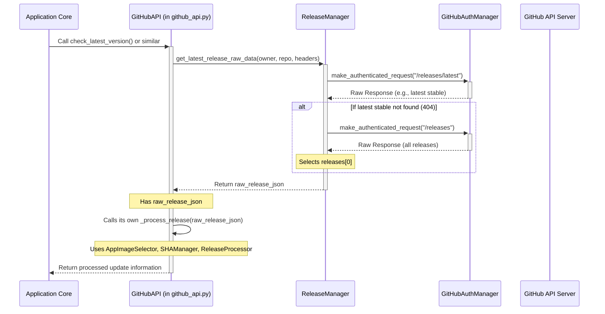

```mermaid
sequenceDiagram
    participant AppCore as Application Core
    participant GitHubApiPy as GitHubAPI (in github_api.py)
    participant ReleaseManagerPy as ReleaseManager
    participant GitHubAuthMgr as GitHubAuthManager
    participant GitHubServer as GitHub API Server

    AppCore->>+GitHubApiPy: Call check_latest_version() or similar
    GitHubApiPy->>+ReleaseManagerPy: get_latest_release_raw_data(owner, repo, headers)
    ReleaseManagerPy->>+GitHubAuthMgr: make_authenticated_request("/releases/latest")
    GitHubAuthMgr-->>-ReleaseManagerPy: Raw Response (e.g., latest stable)
    alt If latest stable not found (404)
        ReleaseManagerPy->>+GitHubAuthMgr: make_authenticated_request("/releases")
        GitHubAuthMgr-->>-ReleaseManagerPy: Raw Response (all releases)
        Note over ReleaseManagerPy: Selects releases[0]
    end
    ReleaseManagerPy-->>-GitHubApiPy: Return raw_release_json
    Note over GitHubApiPy: Has raw_release_json
    GitHubApiPy->>GitHubApiPy: Calls its own _process_release(raw_release_json)
    Note over GitHubApiPy: Uses AppImageSelector, SHAManager, ReleaseProcessor
    GitHubApiPy-->>-AppCore: Return processed update information
```