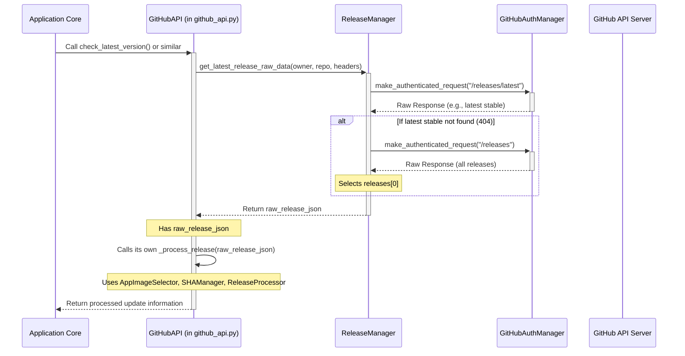
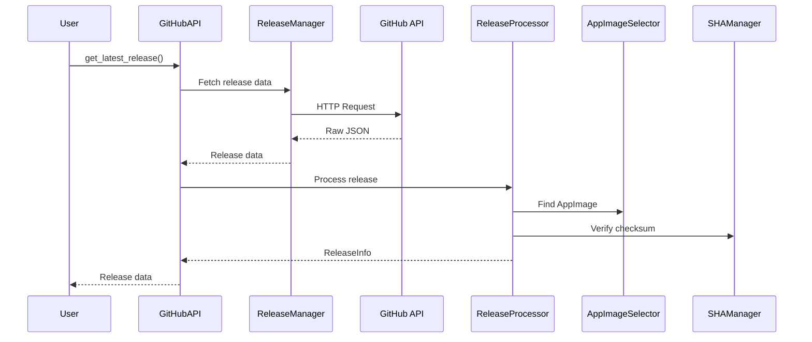
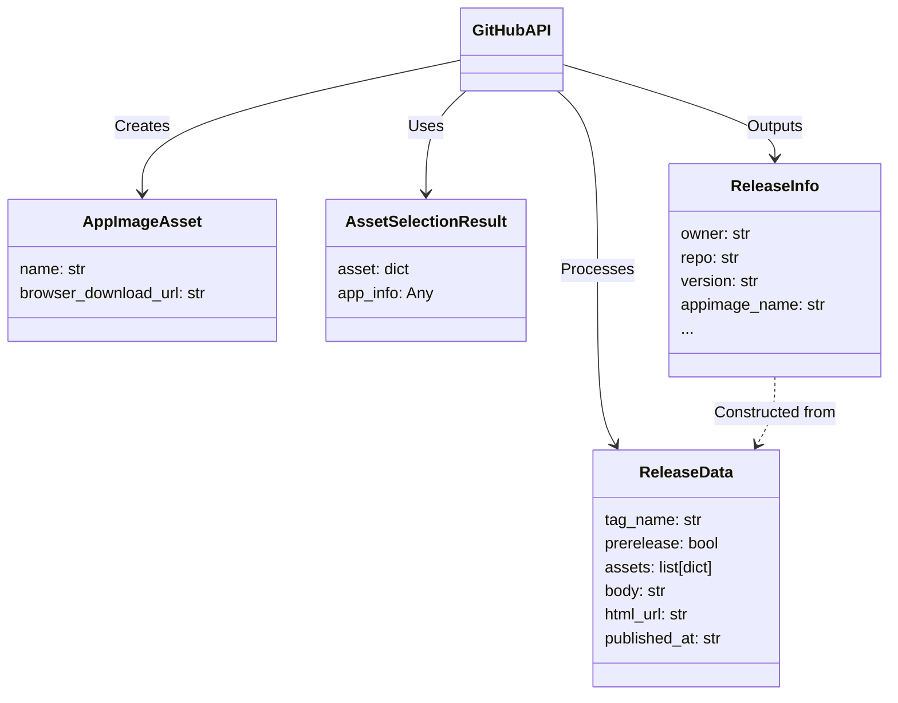

```mermaid
sequenceDiagram
    participant AppCore as Application Core
    participant GitHubApiPy as GitHubAPI (in github_api.py)
    participant ReleaseManagerPy as ReleaseManager
    participant GitHubAuthMgr as GitHubAuthManager
    participant GitHubServer as GitHub API Server

    AppCore->>+GitHubApiPy: Call check_latest_version() or similar
    GitHubApiPy->>+ReleaseManagerPy: get_latest_release_raw_data(owner, repo, headers)
    ReleaseManagerPy->>+GitHubAuthMgr: make_authenticated_request("/releases/latest")
    GitHubAuthMgr-->>-ReleaseManagerPy: Raw Response (e.g., latest stable)
    alt If latest stable not found (404)
        ReleaseManagerPy->>+GitHubAuthMgr: make_authenticated_request("/releases")
        GitHubAuthMgr-->>-ReleaseManagerPy: Raw Response (all releases)
        Note over ReleaseManagerPy: Selects releases[0]
    end
    ReleaseManagerPy-->>-GitHubApiPy: Return raw_release_json
    Note over GitHubApiPy: Has raw_release_json
    GitHubApiPy->>GitHubApiPy: Calls its own _process_release(raw_release_json)
    Note over GitHubApiPy: Uses AppImageSelector, SHAManager, ReleaseProcessor
    GitHubApiPy-->>-AppCore: Return processed update information
```

```mermaid
sequenceDiagram
    User->>GitHubAPI: get_latest_release()
    GitHubAPI->>ReleaseManager: Fetch release data
    ReleaseManager->>GitHub API: HTTP Request
    GitHub API-->>ReleaseManager: Raw JSON
    ReleaseManager-->>GitHubAPI: Release data
    GitHubAPI->>ReleaseProcessor: Process release
    ReleaseProcessor->>AppImageSelector: Find AppImage
    ReleaseProcessor->>SHAManager: Verify checksum
    ReleaseProcessor-->>GitHubAPI: ReleaseInfo
    GitHubAPI-->>User: Release data
```

```mermaid
classDiagram
    class ReleaseData {
        tag_name: str
        prerelease: bool
        assets: list[dict]
        body: str
        html_url: str
        published_at: str
    }
    
    class AppImageAsset {
        name: str
        browser_download_url: str
    }
    
    class AssetSelectionResult {
        asset: dict
        app_info: Any
    }
    
    class ReleaseInfo {
        owner: str
        repo: str
        version: str
        appimage_name: str
        ...
    }
    
    GitHubAPI --> ReleaseData : Processes
    GitHubAPI --> AppImageAsset : Creates
    GitHubAPI --> AssetSelectionResult : Uses
    GitHubAPI --> ReleaseInfo : Outputs
    ReleaseInfo ..> ReleaseData : Constructed from
```