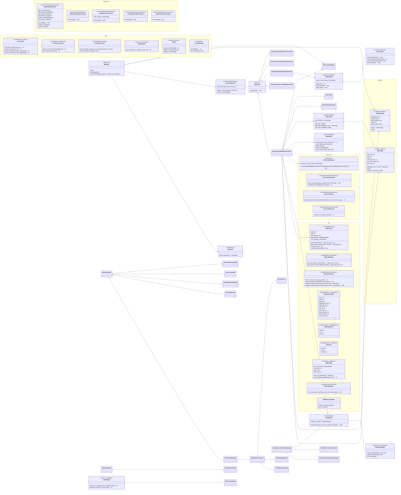

```mermaid
classDiagram
    direction LR

    class MainApp {
        <<Application>>
        +main()
        +setup_logging()
        +handle_exception(exc_type, exc_value, exc_traceback)
    }
    MainApp --> CLIParser
    MainApp --> CommandInvoker
    MainApp --> GlobalConfig

    class CLIParser {
        <<src/parser.py>>
        +parse_arguments(): Namespace
    }

    class CommandInvoker {
        <<src/commands/invoker.py>>
        -commands: Map_String_ICommand
        +register_command(name, command)
        +execute_command(args)
    }
    CommandInvoker o-- ICommand

    class ICommand {
        <<Interface>>
        +execute(args): bool
    }

    namespace Commands {
        class UpdateAppCommand {
            <<src/commands/update_base.py>>
            +app_config: AppConfig
            +global_config: GlobalConfig
            +api_handler: APIInterface
            +downloader: Downloader
            +verifier: VerificationManager
            +file_handler: FileHandler
            +execute(args): bool
            -_check_for_updates()
            -_perform_update()
        }

        class DownloadNewAppCommand {
            <<src/commands/download.py>>
            +execute(args): bool
        }

        class ManageTokenCommand {
            <<src/commands/manage_token.py>>
            +auth_manager: AuthManager
            +execute(args): bool
        }

        class CreateAppConfigCommand {
            <<src/commands/create_app_config.py>>
            +execute(args): bool
        }

        class UpdateAllAsyncCommand {
            <<src/commands/update_all_async.py>>
            +execute(args): bool
        }
    }
    ICommand <|-- Commands.UpdateAppCommand
    Commands.UpdateAppCommand --> AppConfig
    Commands.UpdateAppCommand --> GlobalConfig
    Commands.UpdateAppCommand --> APIInterface
    Commands.UpdateAppCommand --> Downloader
    Commands.UpdateAppCommand --> VerificationManager
    Commands.UpdateAppCommand --> FileHandler
    Commands.UpdateAppCommand --> AppCatalog

    ICommand <|-- commands.install_urlNewAppCommand
    ICommand <|-- Commands.ManageTokenCommand
    Commands.ManageTokenCommand --> AuthManager
    ICommand <|-- Commands.CreateAppConfigCommand
    ICommand <|-- Commands.UpdateAllAsyncCommand


    class AppCatalog {
        <<src/app_catalog.py>>
        +app_configs: List_AppConfig
        +load_app_configs()
        +get_app_config(app_name): AppConfig
        +save_app_config(app_config)
    }
    AppCatalog o-- AppConfig

    namespace Configs {
        class AppConfig {
            <<src/app_config.py>>
            -app_name: str
            -owner: str
            -repo: str
            -current_version: str
            -sha_name_pattern: str
            -hash_type: str
            +load(app_name_or_path): AppConfig
            +save()
            +update_version(new_version)
        }

        class GlobalConfig {
            <<src/global_config.py>>
            -download_dir: str
            -backup_dir: str
            -keep_backups: bool
            -locale: str
            -github_token_path: str
            +load(): GlobalConfig
            +save()
        }
    }

    class AuthManager {
        <<src/auth_manager.py>>
        -secure_token_handler: SecureToken
        +get_token(): str
        +set_token(token): bool
        +clear_token(): bool
    }
    AuthManager o-- SecureToken

    class SecureToken {
        <<src/secure_token.py>>
        +encrypt_token(token): bytes
        +decrypt_token(encrypted_token): str
        +save_token(encrypted_token, path)
        +load_token(path): bytes
    }

    namespace API {
        class APIInterface {
            <<src/api/github_api.py>>
            -owner: str
            -repo: str
            -auth_headers: dict
            -release_fetcher: ReleaseManager
            -icon_manager: IconManager
            +get_latest_release(): tuple_bool_dict_or_str
            +check_latest_version(current_version): tuple_bool_dict
            +find_app_icon(): dict
            -_process_release(release_data)
        }
        
        class ReleaseManager {
            <<src/api/release_manager.py>>
            +get_latest_release_data(headers): tuple_bool_dict_or_str
            +get_specific_release_data(tag, headers): tuple_bool_dict_or_str
        }
        
        class ReleaseProcessor {
            <<src/api/release_processor.py>>
            +extract_version_from_tag(tag_name): str
            +select_appimage_asset(assets, arch_keyword): dict
            +populate_release_info(release_data, asset_info): ReleaseInfo
            +compare_versions(current_version, latest_version, is_prerelease): tuple
        }

        class ReleaseAssetInfo {
            <<src/api/assets.py - ReleaseInfo>>
            +owner: str
            +repo: str
            +version: str
            +appimage_name: str
            +appimage_url: str
            +sha_name: str
            +sha_url: str
            +hash_type: str
            +arch_keyword: str
            +release_notes: str
            +raw_assets: list
        }
        class AppImageAsset {
            <<src/api/assets.py - AppImageAsset>>
            +name: str
            +url: str
            +size: int
        }
        class ShaAsset {
            <<src/api/assets.py - ShaAsset>>
            +name: str
            +url: str
            +content: str
        }

        class ShaManager {
            <<src/api/sha_manager.py>>
            -sha_asset_finder: ShaAssetFinder
            +sha_name: str
            +sha_url: str
            +hash_type: str
            +find_sha_asset(assets): ShaAsset
            +get_expected_hash(appimage_name): str
        }

        class ShaAssetFinder {
            <<src/api/sha_asset_finder.py>>
            +find_asset(assets, appimage_name, sha_name_pattern): dict
        }
        class APIRateLimitHandler {
            +handle_rate_limit(response)
            +wait_if_needed()
        }
    }
    API.APIInterface o-- API.ReleaseManager
    API.APIInterface o-- API.IconManager
    API.APIInterface --> API.APIRateLimitHandler
    API.APIInterface --> Utils.VersionUtils 
    API.APIInterface --> Utils.ArchExtractionUtils 
    API.ReleaseManager o-- API.ReleaseProcessor
    API.ReleaseProcessor o-- API.ReleaseAssetInfo
    API.ReleaseProcessor o-- API.AppImageAsset
    API.ReleaseProcessor o-- API.ShaAsset
    API.ShaManager o-- API.ShaAssetFinder


    class Downloader {
        <<src/download.py>>
        -progress_manager: ProgressManager
        +download_file(url, dest_path, expected_size=None): bool
    }
    Downloader o-- ProgressManager

    class ProgressManager {
        <<src/progress_manager.py>>
        +start_download(filename, total_size)
        +update_progress(chunk_size)
        +finish_download()
    }

    namespace Verification {
        class VerificationManager {
            <<src/verify.py>>
            -checksum_verifier: ChecksumVerification
            +verify_download(filepath, release_info: ReleaseAssetInfo, downloaded_sha_content: str): bool
        }
        
        class ChecksumVerification {
            <<src/utils/checksums/verification.py>>
            +verify_checksum(filepath, expected_hash, hash_type): bool
            +calculate_file_hash(filepath, hash_type): str
        }
        class ChecksumParser {
            <<src/utils/checksums/parser.py>>
            +parse_checksum_file_content(content, filename_to_match, hash_type): str
        }
        class ChecksumExtractor {
            <<src/utils/checksums/extractor.py>>
            +extract_from_text(text, filename): str
        }
    }
    Verification.VerificationManager o-- Verification.ChecksumVerification
    Verification.VerificationManager o-- Verification.ChecksumParser
    Verification.VerificationManager o-- Downloader


    class FileHandler {
        <<src/file_handler.py>>
        +backup_file(src_path, backup_dir): str
        +move_file(src_path, dest_path)
        +delete_file(path)
        +make_executable(path)
        +create_symlink(target, link_name)
    }

    class IconManager {
        <<src/icon_manager.py>>
        +get_icon_for_app(app_name, appimage_path): str
        +download_icon(icon_url, app_name): str
    }
    IconManager o-- Utils.IconPathUtils

    namespace Utils {
        class VersionUtils {
            <<src/utils/version_utils.py>>
            +normalize_version(version_str): str
            +compare_versions(v1, v2): int
            +extract_version(tag_name, is_prerelease): str
            +extract_version_from_filename(filename): str
        }
        class ArchExtractionUtils {
            <<src/utils/arch_extraction.py>>
            +extract_arch_from_filename(filename): str
            +get_current_system_arch(): str
        }
        class DesktopEntryUtils {
            <<src/utils/desktop_entry.py>>
            +create_desktop_entry(app_name, appimage_path, icon_path)
            +remove_desktop_entry(app_name)
        }
        class IconPathUtils {
            <<src/utils/icon_paths.py>>
            +get_standard_icon_path(app_name, size): str
        }
        class UIUtils {
            <<src/utils/ui_utils.py>>
            +prompt_user(message): str
            +display_message(message)
            +display_error(message)
        }
        class LocaleManager {
            <<src/locale.py>>
            +translate(text): str
            +set_locale(locale_code)
        }
    }
    Commands.UpdateAppCommand --> Utils.DesktopEntryUtils
    Commands.UpdateAppCommand --> Utils.UIUtils
    Commands.UpdateAppCommand --> Utils.LocaleManager
    MainApp --> Utils.LocaleManager
```