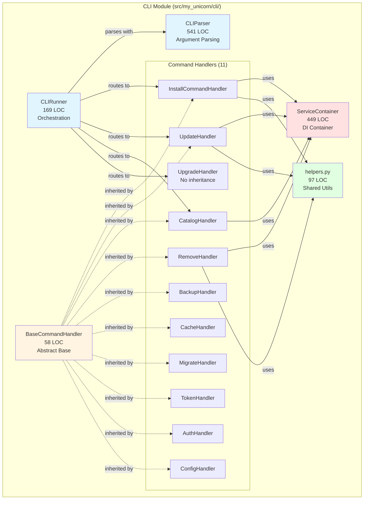
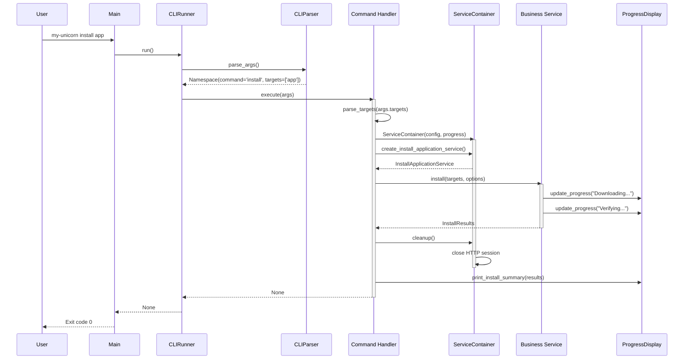
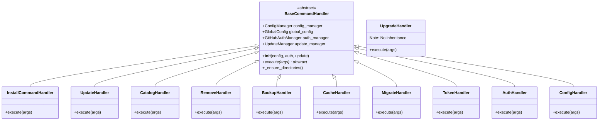
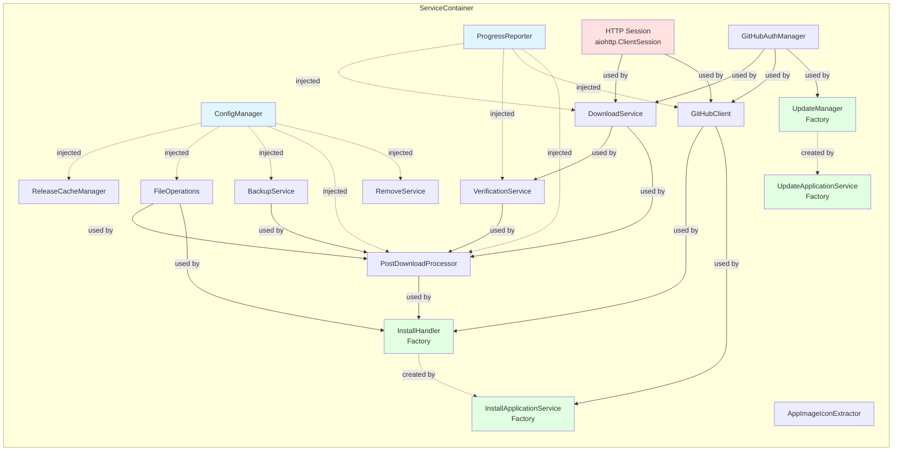

# CLI Module Architecture Blueprint

**Module**: `src/my_unicorn/cli/`  
**Version**: 1.0.0  
**Status**: ACTIVE  
**Last Updated**: 2026-02-03  
**Total LOC**: ~3,044 lines  

---

## Table of Contents

1. [Module Overview](#module-overview)
2. [Component Architecture](#component-architecture)
3. [Design Patterns](#design-patterns)
4. [Architecture Diagrams](#architecture-diagrams)
5. [Key Interfaces](#key-interfaces)
6. [Data Flow](#data-flow)
7. [Dependencies](#dependencies)
8. [Quality Attributes](#quality-attributes)
9. [Technical Debt](#technical-debt)
10. [Extension Points](#extension-points)

---

## Module Overview

### Purpose and Responsibilities

The CLI module serves as the **presentation and orchestration layer** for my-unicorn, responsible for:

- **Argument Parsing**: Processing command-line inputs into structured data
- **Command Routing**: Directing parsed arguments to appropriate handlers
- **Dependency Injection**: Managing service lifecycle and wiring via ServiceContainer
- **Command Orchestration**: Coordinating between UI, configuration, and core business logic
- **Progress Reporting**: Bridging UI progress display with core operations
- **Error Handling**: Presenting user-friendly error messages from system exceptions

### Position in Overall Architecture

The CLI module sits at the **application boundary**, serving as the primary entry point for user interactions:

```
User Input (CLI)
    ↓
CLI Module (this) ← Orchestration Layer
    ↓
Core Module ← Business Logic Layer
    ↓
External Services (GitHub API, File System)
```

**Architectural Role**: Thin coordinator implementing the **Ports & Adapters** pattern (Hexagonal Architecture)

- **Inbound Port**: Command-line interface (CLIParser, CLIRunner)
- **Outbound Ports**: Core services, UI display, configuration management

### Key Design Decisions

| Decision | Rationale | Trade-offs |
|----------|-----------|------------|
| **Thin Command Handlers** (50-100 LOC) | Maintain testability and single responsibility | Business logic must live in service layer |
| **Centralized DI Container** | Avoid service instantiation in handlers | Container complexity increases with services |
| **Lazy Service Initialization** | Reduce startup time and memory usage | Errors deferred until service access |
| **Abstract Base for Handlers** | Enforce consistent interface and shared dependencies | UpgradeHandler exception (no dependencies) |
| **Progress Reporter Protocol** | Decouple UI from core logic | Requires passing reporter through layers |
| **Separate Upgrade Handler** | my-unicorn self-upgrade doesn't need app services | Inconsistent with other handler inheritance |

---

## Component Architecture

### 1. CLIParser (`parser.py`, 541 LOC)

**Responsibility**: Transform raw command-line arguments into structured Namespace objects.

**Key Features**:

- **Argparse-based**: Leverages Python's built-in argparse for robust parsing
- **11 Subcommands**: install, update, upgrade, catalog, migrate, remove, backup, cache, token, auth, config
- **Global Options**: `--version` flag handled before subcommand parsing
- **Configuration-aware**: Default values pulled from global config (e.g., max_concurrent_downloads)
- **Rich Help Text**: Examples and detailed usage in epilog sections

**Public API**:

```python
class CLIParser:
    def __init__(self, global_config: dict[str, Any]) -> None
    def parse_args(self) -> Namespace
```

**Design Notes**:

- Avoids `-v` shorthand for `--version` to prevent collision with `--verbose` in subcommands
- Uses `RawDescriptionHelpFormatter` for multi-line examples in help text

---

### 2. CLIRunner (`runner.py`, 169 LOC)

**Responsibility**: Orchestrate command execution by initializing shared dependencies and routing to handlers.

**Key Features**:

- **Shared Dependency Management**: Initializes ConfigManager, GitHubAuthManager, UpdateManager once
- **Handler Registry**: Maps command names to handler instances in `_init_command_handlers()`
- **Logger Configuration**: Updates logger with config-based log levels via `update_logger_from_config()`
- **Global Flag Handling**: Processes `--version` before command routing
- **Error Propagation**: Re-raises exceptions after logging for main.py to handle

**Execution Flow**:

```python
async def run(self) -> None:
    1. Parse arguments (CLIParser)
    2. Handle --version flag
    3. Validate command existence
    4. Route to handler.execute(args)
    5. Propagate exceptions upward
```

**Dependency Initialization Pattern**:

```python
# Shared once per CLI invocation
self.config_manager = ConfigManager()
self.global_config = self.config_manager.load_global_config()
self.auth_manager = GitHubAuthManager.create_default()
self.update_manager = UpdateManager(self.config_manager, self.auth_manager)
```

**Design Notes**:

- **No cleanup**: Runner doesn't manage ServiceContainer lifecycle (handlers do)
- **Exception boundary**: Logs but re-raises for main.py crash handler

---

### 3. ServiceContainer (`container.py`, 449 LOC)

**Responsibility**: Centralized dependency injection container managing service lifecycle and wiring.

**Key Features**:

- **Lazy Initialization**: All 11 services created on first property access
- **Scoped Instances**: One instance per service within a container (not global singletons)
- **Factory Methods**: 5 methods for creating complex workflows (install_handler, update_manager, etc.)
- **HTTP Session Management**: Owns aiohttp.ClientSession with explicit cleanup
- **Comprehensive Documentation**: 100+ lines of docstrings explaining usage and lifecycle

**Service Catalog** (11 scoped instances):

```python
@property services:
    1. session: aiohttp.ClientSession
    2. auth_manager: GitHubAuthManager
    3. cache_manager: ReleaseCacheManager
    4. file_ops: FileOperations
    5. download_service: DownloadService
    6. verification_service: VerificationService
    7. icon_extractor: AppImageIconExtractor
    8. github_client: GitHubClient
    9. backup_service: BackupService
    10. post_download_processor: PostDownloadProcessor
    11. remove_service: RemoveService
```

**Factory Methods** (5):

```python
def create_install_handler(self) -> InstallHandler
def create_install_application_service(self) -> InstallApplicationService
def create_update_manager(self) -> UpdateManager
def create_update_application_service(self) -> UpdateApplicationService
def create_remove_service(self) -> RemoveService
```

**Lifecycle Management**:

```python
# Creation
container = ServiceContainer(config_manager, progress_reporter)

# Usage (lazy loading)
service = container.create_install_application_service()

# Cleanup (required in finally block)
await container.cleanup()  # Closes HTTP session
```

**Design Notes**:

- **Not thread-safe**: Designed for single event loop per container instance
- **Global config caching**: Loads once via `@property global_config`
- **Optional dependencies**: ConfigManager and ProgressReporter default to NullProgressReporter if None

---

### 4. BaseCommandHandler (`commands/base.py`, 58 LOC)

**Responsibility**: Abstract base class enforcing consistent interface and shared dependency injection for all command handlers.

**Key Features**:

- **Abstract Base Class (ABC)**: Uses Python's `@abstractmethod` to enforce `execute(args)` implementation
- **Shared Dependency Injection**: All handlers receive ConfigManager, GitHubAuthManager, UpdateManager
- **Global Config Caching**: Loads global config in `__init__` for handler use
- **Directory Setup Utility**: Provides `_ensure_directories()` helper method

**Abstract Interface**:

```python
class BaseCommandHandler(ABC):
    def __init__(
        self,
        config_manager: ConfigManager,
        auth_manager: GitHubAuthManager,
        update_manager: UpdateManager,
    ) -> None
    
    @abstractmethod
    async def execute(self, args: Namespace) -> None
        """Must be implemented by concrete handlers."""
```

**Concrete Handler Pattern**:

```python
class InstallCommandHandler(BaseCommandHandler):
    async def execute(self, args: Namespace) -> None:
        # 1. Parse/validate input
        targets = parse_targets(args.targets)
        
        # 2. Setup (directories, paths)
        ensure_app_directories(...)
        
        # 3. Create ServiceContainer for DI
        container = ServiceContainer(self.config_manager, progress_display)
        
        # 4. Execute via service layer
        try:
            service = container.create_install_application_service()
            results = await service.install(targets, options)
        finally:
            await container.cleanup()
        
        # 5. Display results
        print_install_summary(results)
```

**Design Notes**:

- **Thin by Design**: Handlers are 50-100 LOC coordinators, not business logic
- **Exception**: UpgradeHandler doesn't inherit (self-upgrade needs no app services)

---

### 5. Command Handlers (13 handlers, 50-100 LOC each)

**Concrete Implementations** inheriting from BaseCommandHandler:

| Handler | File | Responsibility | ServiceContainer Usage |
|---------|------|----------------|------------------------|
| **InstallCommandHandler** | `install.py` | Install AppImages from catalog/URLs | Creates InstallApplicationService |
| **UpdateHandler** | `update.py` | Update installed AppImages | Creates UpdateApplicationService |
| **CatalogHandler** | `catalog.py` | Display/search application catalog | Creates CatalogService inline |
| **RemoveHandler** | `remove.py` | Remove installed AppImages | Creates RemoveService |
| **BackupHandler** | `backup.py` | Manage AppImage backups | Uses BackupService |
| **CacheHandler** | `cache.py` | Manage release cache | Uses ReleaseCacheManager |
| **MigrateHandler** | `migrate.py` | Migrate configuration versions | Uses config migration utilities |
| **TokenHandler** | `token.py` | Manage GitHub API tokens | Uses TokenStorage |
| **AuthHandler** | `auth.py` | Check authentication status | Uses GitHubAuthManager |
| **ConfigHandler** | `config.py` | Display configuration | Direct config access |

**Special Cases** (not inheriting BaseCommandHandler):

| Handler | File | Responsibility | Why Different? |
|---------|------|----------------|----------------|
| **UpgradeHandler** | `upgrade.py` | Upgrade my-unicorn itself | Self-upgrade doesn't need app config/auth |

**Common Handler Structure** (template):

```python
class SomeHandler(BaseCommandHandler):
    async def execute(self, args: Namespace) -> None:
        # 1. Input validation
        targets = parse_targets(args.targets)
        if not targets:
            display_error()
            return
        
        # 2. Environment setup
        ensure_app_directories(self.config_manager, self.global_config)
        
        # 3. Create service dependencies
        container = ServiceContainer(self.config_manager, progress_display)
        
        # 4. Execute business logic via services
        try:
            service = container.create_some_service()
            results = await service.do_work(targets, options)
        finally:
            await container.cleanup()
        
        # 5. Display results to user
        print_summary(results)
```

---

### 6. Command Helpers (`commands/helpers.py`, 97 LOC)

**Responsibility**: Shared utility functions for common parsing and setup tasks across handlers.

**Key Functions**:

```python
def parse_targets(targets: list[str] | None) -> list[str]:
    """Parse comma-separated targets, remove duplicates, preserve order."""
    
def get_install_paths(global_config: GlobalConfig) -> tuple[Path, Path]:
    """Extract (install_dir, download_dir) from config."""
    
def ensure_app_directories(
    config_manager: ConfigManager,
    global_config: GlobalConfig
) -> None:
    """Ensure required directories exist (wrapper for clarity)."""
```

**Design Notes**:

- **DRY Principle**: Reusable by 2+ handlers to avoid duplication
- **YAGNI Adherence**: Only functions used by multiple handlers (no speculative utilities)
- **Type Safety**: Full type hints for IDE support

---

## Design Patterns

### 1. Command Pattern

**Implementation**: Each CLI command is a handler implementing `BaseCommandHandler.execute(args)`.

**Benefits**:

- **Decoupling**: Command invocation (runner) separated from execution (handler)
- **Extensibility**: New commands added without modifying runner
- **Testability**: Each handler tested in isolation

**Structure**:

```
Invoker: CLIRunner
Command Interface: BaseCommandHandler.execute()
Concrete Commands: InstallCommandHandler, UpdateHandler, etc.
Receiver: Service layer (core module)
```

---

### 2. Dependency Injection (DI)

**Implementation**: ServiceContainer provides centralized DI with lazy-loaded scoped instances (not global singletons).

**Benefits**:

- **Testability**: Inject mocks for unit tests; no global state to reset
- **Lifecycle Management**: Centralized HTTP session cleanup
- **Configuration**: Services receive consistent dependencies
- **Isolation**: Each container has its own service instances, enabling parallel testing

**Two-Level DI**:

1. **Handler-Level DI** (via BaseCommandHandler):

   ```python
   handler = InstallCommandHandler(config_manager, auth_manager, update_manager)
   ```

2. **Service-Level DI** (via ServiceContainer):

   ```python
   container = ServiceContainer(config_manager, progress_reporter)
   service = container.create_install_application_service()
   ```

---

### 3. Factory Pattern

**Implementation**: ServiceContainer exposes 5 factory methods for complex workflow creation.

**Benefits**:

- **Encapsulation**: Hides complex wiring from handlers
- **Consistency**: Services always wired with correct dependencies
- **Flexibility**: Factories can switch implementations without handler changes

**Example**:

```python
def create_install_application_service(self) -> InstallApplicationService:
    return InstallApplicationService(
        session=self.session,
        github_client=self.github_client,
        config_manager=self.config,
        install_dir=self.install_dir,
        progress_reporter=self.progress,
    )
```

---

### 4. Template Method Pattern

**Implementation**: BaseCommandHandler defines shared initialization, concrete handlers implement `execute()`.

**Benefits**:

- **Code Reuse**: Shared dependency injection in base class
- **Consistency**: All handlers have access to config, auth, update manager
- **Flexibility**: Handlers override only execution logic

**Structure**:

```python
# Template (base class)
class BaseCommandHandler:
    def __init__(self, config, auth, update_manager):
        self.config = config
        self.global_config = config.load_global_config()
    
    @abstractmethod
    async def execute(self, args): ...

# Concrete implementation
class InstallCommandHandler(BaseCommandHandler):
    async def execute(self, args):  # Override template method
        # Custom install logic
```

---

### 5. Strategy Pattern

**Implementation**: Handlers use container-provided services with different strategies (install, update, remove).

**Benefits**:

- **Algorithm Flexibility**: Swap service implementations without handler changes
- **Separation of Concerns**: Business logic in services, coordination in handlers

---

### 6. Scoped Instance Pattern (Replaces Singleton)

**Implementation**: ServiceContainer ensures one instance per service via lazy-loaded properties. Unlike global singletons, these are **container-scoped** instances that enable proper test isolation.

**Benefits**:

- **Resource Efficiency**: One HTTP session per container
- **Consistency**: Services share dependencies (e.g., same auth_manager)
- **Test Isolation**: Each test can create its own container with mocked dependencies
- **No Global State**: Eliminates hidden dependencies and shared mutable state

**Pattern**:

```python
@property
def github_client(self) -> GitHubClient:
    if self._github_client is None:
        self._github_client = GitHubClient(...)
    return self._github_client
```

**Note**: Global module-level singletons (`get_cache_manager()`, `get_validator()`, module-level `config_manager`) were removed in favor of explicit dependency injection via CLIRunner as composition root. The logger singleton (`_state` in `logger.py`) is intentionally preserved for cross-cutting logging infrastructure.

---

## Architecture Diagrams

### 1. Component Structure Diagram



**Diagram Description**: CLI module component hierarchy showing CLIParser and CLIRunner at the orchestration level, ServiceContainer as the DI hub, BaseCommandHandler as the abstract template, and 11 command handlers (10 inheriting from base, 1 standalone). Helpers module provides shared utilities.

---

### 2. Command Execution Flow (Sequence Diagram)



**Diagram Description**: Sequence diagram illustrating the command execution pipeline from user input through CLIRunner orchestration, command handler coordination, ServiceContainer dependency injection, business service execution, and progress UI feedback loop.

---

### 3. Command Handler Hierarchy (Class Diagram)



**Diagram Description**: Class diagram showing BaseCommandHandler as the abstract template with shared dependency injection (config_manager, auth_manager, update_manager), and 10 concrete handlers inheriting the template. UpgradeHandler exists outside the hierarchy as it requires no app-level dependencies.

---

### 4. ServiceContainer Dependency Graph



**Diagram Description**: Dependency graph showing ServiceContainer's 11 scoped service instances and their relationships. Blue nodes are injected dependencies (ConfigManager, ProgressReporter), red node is managed resource (HTTP session), green nodes are factory-created workflows. Arrows show service composition. Note: These are container-scoped instances, not global singletons.

---

## Key Interfaces

### 1. BaseCommandHandler Abstract Interface

**Purpose**: Enforce consistent command handler structure across all CLI commands.

```python
from abc import ABC, abstractmethod
from argparse import Namespace

class BaseCommandHandler(ABC):
    """Abstract base class for all command handlers."""
    
    def __init__(
        self,
        config_manager: ConfigManager,
        auth_manager: GitHubAuthManager,
        update_manager: UpdateManager,
    ) -> None:
        """Initialize with shared dependencies injected by CLIRunner."""
        self.config_manager = config_manager
        self.global_config = config_manager.load_global_config()
        self.auth_manager = auth_manager
        self.update_manager = update_manager
    
    @abstractmethod
    async def execute(self, args: Namespace) -> None:
        """Execute command with parsed arguments.
        
        Must be implemented by concrete handlers.
        Raises exceptions for CLIRunner to handle.
        """
        pass
    
    def _ensure_directories(self) -> None:
        """Ensure required directories exist based on global config."""
        self.config_manager.ensure_directories_from_config(self.global_config)
```

**Contract**:

- Handlers receive dependencies via constructor injection
- Handlers implement `execute(args)` to perform command logic
- Handlers coordinate but delegate business logic to services
- Handlers propagate exceptions upward (no top-level exception handling)

---

### 2. ServiceContainer Public API

**Purpose**: Centralize service creation and dependency wiring for command handlers.

```python
class ServiceContainer:
    """DI container managing service lifecycle and dependencies."""
    
    # === Constructor ===
    def __init__(
        self,
        config_manager: ConfigManager | None = None,
        progress_reporter: ProgressReporter | None = None,
    ) -> None:
        """Initialize with optional dependencies (defaults to NullProgressReporter)."""
    
    # === Service Properties (Lazy-loaded Container-Scoped Instances) ===
    @property
    def session(self) -> aiohttp.ClientSession: ...
    
    @property
    def auth_manager(self) -> GitHubAuthManager: ...
    
    @property
    def github_client(self) -> GitHubClient: ...
    
    @property
    def download_service(self) -> DownloadService: ...
    
    @property
    def verification_service(self) -> VerificationService: ...
    
    # ... 6 more service properties
    
    # === Factory Methods ===
    def create_install_handler(self) -> InstallHandler:
        """Factory for fully wired InstallHandler workflow."""
    
    def create_install_application_service(self) -> InstallApplicationService:
        """Factory for install workflow with preflight checks."""
    
    def create_update_manager(self) -> UpdateManager:
        """Factory for update orchestration service."""
    
    def create_update_application_service(self) -> UpdateApplicationService:
        """Factory for update workflow with progress."""
    
    def create_remove_service(self) -> RemoveService:
        """Factory for app removal service."""
    
    # === Lifecycle Management ===
    async def cleanup(self) -> None:
        """Close HTTP session and release resources.
        
        MUST be called in finally block after usage.
        """
```

**Usage Pattern**:

```python
container = ServiceContainer(config_manager, progress_display)
try:
    service = container.create_install_application_service()
    results = await service.install(targets, options)
finally:
    await container.cleanup()
```

---

### 3. CLI Argument Structure (Namespace)

**Purpose**: Structured representation of parsed command-line arguments.

**Common Arguments**:

```python
# install command
Namespace(
    command='install',
    targets=['app1', 'app2'],
    concurrency=5,
    no_icon=False,
    no_verify=False,
    no_desktop=False,
    verbose=False,
)

# update command
Namespace(
    command='update',
    targets=['app1'],  # Optional, None = update all
    concurrency=5,
    force=False,
    verbose=False,
)

# catalog command
Namespace(
    command='catalog',
    available=False,
    info='app_name',  # Optional
)
```

**Accessing Arguments**:

```python
# Use getattr with default for optional fields
targets = getattr(args, "targets", None)
verify = not getattr(args, "no_verify", False)
```

---

### 4. ProgressReporter Protocol

**Purpose**: Abstraction for progress reporting decoupled from UI implementation.

```python
from typing import Protocol

class ProgressReporter(Protocol):
    """Protocol for progress reporting across CLI and service layers."""
    
    def update(self, description: str, advance: int = 1) -> None:
        """Update progress with task description and advancement."""
    
    def finish(self) -> None:
        """Mark operation as complete."""
```

**Implementations**:

- **ProgressDisplay**: Rich-based CLI progress bars (used by handlers)
- **NullProgressReporter**: No-op for testing (used in unit tests)

---

## Data Flow

### User Input → Parsed Args → Command Routing → Handler Execution → Service Layer

```
┌─────────────────────────────────────────────────────────────────┐
│ 1. User Input                                                   │
│    $ my-unicorn install appflowy,joplin --concurrency=3         │
└────────────────────────┬────────────────────────────────────────┘
                         │
                         ▼
┌─────────────────────────────────────────────────────────────────┐
│ 2. Argument Parsing (CLIParser)                                 │
│    → Namespace(command='install', targets=['appflowy,joplin'],  │
│                concurrency=3, no_verify=False, ...)             │
└────────────────────────┬────────────────────────────────────────┘
                         │
                         ▼
┌─────────────────────────────────────────────────────────────────┐
│ 3. Command Routing (CLIRunner)                                  │
│    → command_handlers['install'].execute(args)                  │
└────────────────────────┬────────────────────────────────────────┘
                         │
                         ▼
┌─────────────────────────────────────────────────────────────────┐
│ 4. Handler Coordination (InstallCommandHandler)                 │
│    a. Parse/validate: targets = parse_targets(['appflowy,...']) │
│       → ['appflowy', 'joplin']                                  │
│    b. Setup directories: ensure_app_directories()               │
│    c. Create options: InstallOptions(concurrent=3, verify=True) │
│    d. Create container: ServiceContainer(config, progress)      │
└────────────────────────┬────────────────────────────────────────┘
                         │
                         ▼
┌─────────────────────────────────────────────────────────────────┐
│ 5. Service Execution (InstallApplicationService)                │
│    → service.install(['appflowy', 'joplin'], options)           │
│    ├─ Resolve targets (catalog → GitHub repo)                   │
│    ├─ Fetch releases (GitHub API)                               │
│    ├─ Download AppImages (concurrent)                           │
│    ├─ Verify hashes (SHA256/SHA512)                             │
│    ├─ Install to storage directory                              │
│    ├─ Extract icons                                             │
│    ├─ Create desktop entries                                    │
│    └─ Update app config files                                   │
└────────────────────────┬────────────────────────────────────────┘
                         │
                         ▼
┌─────────────────────────────────────────────────────────────────┐
│ 6. Results Display (print_install_summary)                      │
│    ✓ Successfully installed: appflowy, joplin                   │
│    ✗ Failed: (none)                                             │
└─────────────────────────────────────────────────────────────────┘
```

### Progress Reporting Flow (via ProgressReporter Protocol)

```
Handler Layer                  Service Layer              UI Layer
─────────────                  ─────────────              ────────
InstallCommandHandler          InstallService            ProgressDisplay
     │                               │                         │
     ├─ Create ProgressDisplay ──────┼─────────────────────────┤
     │                               │                         │
     ├─ Inject into ServiceContainer │                         │
     │                               │                         │
     ├─ service.install() ──────────►│                         │
     │                               │                         │
     │                               ├─ progress.update(       │
     │                               │   "Downloading app1")──►│
     │                               │                         ├─ [=====    ]
     │                               │                         │
     │                               ├─ progress.update(       │
     │                               │   "Verifying app1") ───►│
     │                               │                         ├─ [========  ]
     │                               │                         │
     │                               ├─ progress.update(       │
     │                               │   "Installing app1") ──►│
     │                               │                         ├─ [=========]
     │                               │                         │
     │◄─── results ──────────────────┤                         │
     │                                                         │
     ├─ print_summary(results) ───────────────────────────────►│
     │                                                         ├─ Display summary
```

**Key Characteristics**:

- **Protocol-based**: Service layer uses ProgressReporter interface, not concrete UI
- **Unidirectional**: Services push updates, UI never calls back
- **Async-safe**: Progress updates happen within same event loop as operations

---

## Dependencies

### Inbound Dependencies (Called By)

```
main.py (application entry point)
    └─► CLIRunner.run()
        └─► Command handlers
            └─► ServiceContainer
```

**Entry Point**:

```python
# src/my_unicorn/main.py
async def async_main() -> None:
    runner = CLIRunner()
    await runner.run()
```

---

### Outbound Dependencies (Uses)

**Module-Level Dependencies**:

| Module | Components Used | Purpose |
|--------|----------------|---------|
| **config** | `ConfigManager`, `GlobalConfig`, `AppConfig` | Load/save configuration |
| **core** | 15+ components (see below) | Business logic delegation |
| **ui** | `ProgressDisplay`, display formatters | User interface |
| **types** | `GlobalConfig`, `AppConfig`, `InstallOptions` | Type definitions |
| **logger** | `get_logger()`, `update_logger_from_config()` | Logging setup |
| **exceptions** | `MyUnicornError`, `ConfigError` | Exception handling |

**Core Module Breakdown**:

```python
# Authentication & Authorization
from my_unicorn.core.auth import GitHubAuthManager
from my_unicorn.core.token import TokenStorage

# Data & Caching
from my_unicorn.core.cache import ReleaseCacheManager
from my_unicorn.config.catalog import CatalogService

# File Operations
from my_unicorn.core.file_ops import FileOperations
from my_unicorn.core.download import DownloadService
from my_unicorn.core.verification import VerificationService
from my_unicorn.core.icon import AppImageIconExtractor

# GitHub Integration
from my_unicorn.core.github import GitHubClient

# Workflows
from my_unicorn.core.workflows.install import InstallHandler
from my_unicorn.core.workflows.update import UpdateManager
from my_unicorn.core.services.install_service import InstallApplicationService
from my_unicorn.core.services.update_service import UpdateApplicationService
from my_unicorn.core.workflows.post_download import PostDownloadProcessor

# Other Services
from my_unicorn.core.backup import BackupService
from my_unicorn.core.remove import RemoveService

# Protocols
from my_unicorn.core.protocols.progress import ProgressReporter, NullProgressReporter
```

**Dependency Direction** (follows Clean Architecture):

```
CLI Module (Presentation)
    ↓ depends on
Core Module (Business Logic)
    ↓ depends on
Infrastructure (File System, HTTP)
```

---

## Quality Attributes

### 1. Testability

**Score**: ★★★★☆ (4/5)

**Strengths**:

- **Dependency Injection**: ServiceContainer allows mocking all services
- **Thin Handlers**: 50-100 LOC handlers easy to unit test
- **Protocol-based Progress**: NullProgressReporter for test isolation
- **Clear Separation**: Parser, Runner, Handlers tested independently

**Example Test**:

```python
@pytest.mark.asyncio
async def test_install_handler_with_mocked_services(mock_container):
    handler = InstallCommandHandler(config_manager, auth_manager, update_manager)
    args = Namespace(targets=["app1"], concurrency=1, no_verify=False)
    
    # Mock ServiceContainer to return fake service
    with patch('cli.commands.install.ServiceContainer', return_value=mock_container):
        await handler.execute(args)
    
    # Assert service.install() was called with correct args
    mock_container.create_install_application_service.assert_called_once()
```

**Weaknesses**:

- UpgradeHandler creates dependencies inline (harder to mock)
- ServiceContainer properties not easily mockable (need to patch all 11)

---

### 2. Extensibility

**Score**: ★★★★★ (5/5)

**Strengths**:

- **Command Pattern**: New commands added without modifying runner
- **Abstract Base**: BaseCommandHandler enforces consistent interface
- **ServiceContainer**: New services added via properties/factories
- **Helper Module**: Shared utilities reusable across handlers

**Adding New Command** (4 steps):

1. Create handler class inheriting BaseCommandHandler
2. Implement `execute(args)` method
3. Add subcommand in CLIParser
4. Register handler in CLIRunner._init_command_handlers()

**Example**:

```python
# Step 1: Create handler
class ExportHandler(BaseCommandHandler):
    async def execute(self, args: Namespace) -> None:
        # Implementation

# Step 3: Add to parser
def _add_export_command(self, subparsers):
    subparsers.add_parser("export", help="Export app data")

# Step 4: Register in runner
self.command_handlers["export"] = self._create_handler(ExportHandler)
```

---

### 3. Maintainability

**Score**: ★★★★☆ (4/5)

**Strengths**:

- **Clear Separation**: Parser, Runner, Container, Handlers have distinct responsibilities
- **Thin Handlers**: 50-100 LOC per handler prevents bloat
- **Comprehensive Docs**: ServiceContainer has 100+ lines of docstrings
- **Consistent Patterns**: All handlers follow same structure

**Code Quality Metrics**:

```
Total LOC: ~3,044
Average Handler LOC: ~60 (excellent)
Largest Component: parser.py (541 LOC)
ServiceContainer LOC: 449 (11 services + 5 factories)
```

**Weaknesses**:

- ServiceContainer growing (11 properties + 5 factories approaching threshold)
- No explicit Protocol for command handlers (relies on ABC duck typing)
- Manual cleanup pattern (container.cleanup()) error-prone without try/finally

---

### 4. Performance

**Score**: ★★★★☆ (4/5)

**Strengths**:

- **Lazy Initialization**: Services created only when needed
- **Scoped Instance Pattern**: One HTTP session per container (connection pooling, not global singleton)
- **Concurrent Operations**: Handlers use asyncio for parallel installs/updates
- **Minimal Startup**: CLIRunner loads only config/auth before routing

**Optimizations**:

- Global config loaded once and cached in ServiceContainer
- HTTP session reused across all network operations
- Progress reporter abstraction adds negligible overhead

**Weaknesses**:

- ServiceContainer cleanup requires manual try/finally (no context manager)
- UpgradeHandler creates new HTTP session inline (no reuse)

---

### 5. Security

**Score**: ★★★☆☆ (3/5)

**Strengths**:

- **Keyring Integration**: GitHub tokens stored in system keyring (via TokenStorage)
- **No Hardcoded Secrets**: Configuration externalized to ~/.config/my-unicorn/
- **Hash Verification**: Optional --no-verify flag (defaults to secure)

**Weaknesses**:

- Token handling mixed in CLI handlers (should be abstracted)
- No input sanitization for file paths from config
- No rate limiting on GitHub API calls (could hit abuse detection)

---

### 6. Error Handling

**Score**: ★★★☆☆ (3/5)

**Strengths**:

- **Exception Propagation**: Handlers re-raise for main.py crash handler
- **User-Friendly Errors**: Display helpers for common issues (no targets, auth failure)
- **Cleanup on Error**: try/finally ensures container.cleanup()

**Weaknesses**:

- No centralized error mapping (e.g., aiohttp exceptions → user messages)
- Handlers don't catch specific exceptions (rely on service layer)
- No retry logic in handlers (delegated to services)

---

---

**Document Version**: 1.0.0  
**Codebase Version**: my-unicorn 0.1.x (tracked in pyproject.toml)  
**Next Review**: 2026-05-03 (quarterly)  

---
