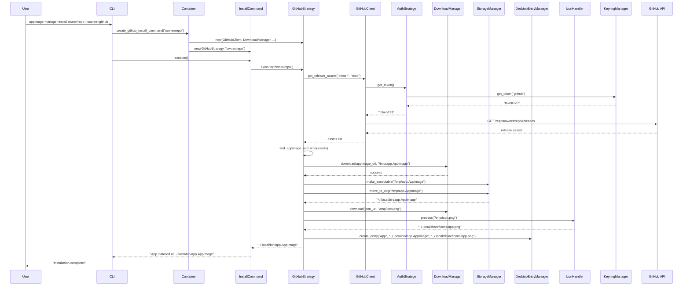

## Installation Flow

> [!WARNING]
> Currently, example and not representative of actual installation flow.
> TODO: Implement actual installation flow.

```mermaid
sequenceDiagram
    participant User
    participant CLI
    participant Container
    participant InstallCommand
    participant GitHubStrategy
    participant GitHubClient
    participant AuthStrategy
    participant DownloadManager
    participant StorageManager
    participant DesktopEntryManager
    participant IconHandler

    User->>CLI: appimage-manager install owner/repo --source=github
    CLI->>Container: create_github_install_command("owner/repo")
    Container->>GitHubStrategy: new(GitHubClient, DownloadManager, ...)
    Container->>InstallCommand: new(GitHubStrategy, "owner/repo")
    CLI->>InstallCommand: execute()

    InstallCommand->>GitHubStrategy: execute("owner/repo")
    GitHubStrategy->>GitHubClient: get_release_assets("owner", "repo")
    GitHubClient->>AuthStrategy: get_token()
    AuthStrategy->>KeyringManager: get_token("github")
    KeyringManager-->>AuthStrategy: "token123"
    AuthStrategy-->>GitHubClient: "token123"
    GitHubClient->>GitHub API: GET /repos/owner/repo/releases
    GitHub API-->>GitHubClient: release assets
    GitHubClient-->>GitHubStrategy: assets list

    GitHubStrategy->>GitHubStrategy: find_appimage_and_icon(assets)
    GitHubStrategy->>DownloadManager: download(appimage_url, "/tmp/app.AppImage")
    DownloadManager-->>GitHubStrategy: success
    GitHubStrategy->>StorageManager: make_executable("/tmp/app.AppImage")
    GitHubStrategy->>StorageManager: move_to_xdg("/tmp/app.AppImage")
    StorageManager-->>GitHubStrategy: "~/.local/bin/app.AppImage"

    GitHubStrategy->>DownloadManager: download(icon_url, "/tmp/icon.png")
    GitHubStrategy->>IconHandler: process("/tmp/icon.png")
    IconHandler-->>GitHubStrategy: "~/.local/share/icons/app.png"
    GitHubStrategy->>DesktopEntryManager: create_entry("App", "~/.local/bin/app.AppImage", "~/.local/share/icons/app.png")

    GitHubStrategy-->>InstallCommand: "~/.local/bin/app.AppImage"
    InstallCommand-->>CLI: "App installed at ~/.local/bin/app.AppImage"
    CLI-->>User: "Installation complete!"
```
