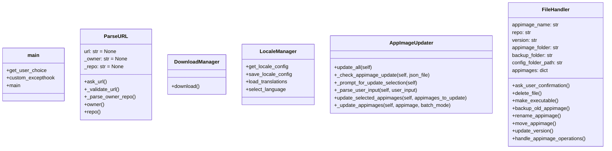

```mermaid
classDiagram
	class main {
		+get_user_choice
		+custom_excepthook
		+main
	}
	class ParseURL {
		url: str = None
		_owner: str = None
		_repo: str = None
	
		+ask_url()
		+_validate_url()
		+_parse_owner_repo()
		+owner()
		+repo()
	}
	class DownloadManager {
		+download()
	}
	class LocaleManager {
		+get_locale_config
		+save_locale_config
		+load_translations
		+select_language
	}
	class AppImageUpdater {
		+update_all(self)
		+_check_appimage_update(self, json_file)
		+_prompt_for_update_selection(self)
		+_parse_user_input(self, user_input)
		+update_selected_appimages(self, appimages_to_update)
		+_update_appimages(self, appimage, batch_mode)
	}
	class FileHandler {
	    appimage_name: str
	    repo: str
	    version: str
	    appimage_folder: str
	    backup_folder: str
	    config_folder_path: str
	    appimages: dict	
	
		+ask_user_confirmation()
		+delete_file()
		+make_executable()
		+backup_old_appimage()
		+rename_appimage()
		+move_appimage()
		+update_version()
		+handle_appimage_operations()
	}
```