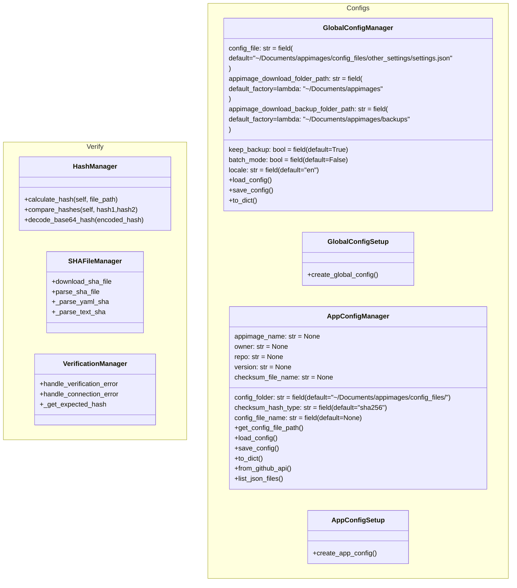

```mermaid
classDiagram
namespace Verify {
	class HashManager {
		+calculate_hash(self, file_path)
		+compare_hashes(self, hash1,hash2)
		+decode_base64_hash(encoded_hash)
	}
	class SHAFileManager {
		+download_sha_file
		+parse_sha_file
		+_parse_yaml_sha
		+_parse_text_sha	
	}
	class VerificationManager {
		+handle_verification_error
		+handle_connection_error
		+_get_expected_hash
	}
}
namespace Configs {
    class GlobalConfigManager {
		config_file: str = field(
	        default="~/Documents/appimages/config_files/other_settings/settings.json"
	    )
	    appimage_download_folder_path: str = field(
	        default_factory=lambda: "~/Documents/appimages"
	    )
	    appimage_download_backup_folder_path: str = field(
	        default_factory=lambda: "~/Documents/appimages/backups"
	    )
	    keep_backup: bool = field(default=True)
	    batch_mode: bool = field(default=False)
	    locale: str = field(default="en")  

		+load_config()
		+save_config()
		+to_dict()
    }
	class GlobalConfigSetup {
			+create_global_config()
    }
	class AppConfigManager {
	    appimage_name: str = None
	    config_folder: str = field(default="~/Documents/appimages/config_files/")
	    owner: str = None
	    repo: str = None
	    version: str = None
	    checksum_file_name: str = None
	    checksum_hash_type: str = field(default="sha256")
	    config_file_name: str = field(default=None)

		+get_config_file_path()
		+load_config()
		+save_config()
		+to_dict()
		+from_github_api()
		+list_json_files()
    }
	class AppConfigSetup {
			+create_app_config()
    }
}

```