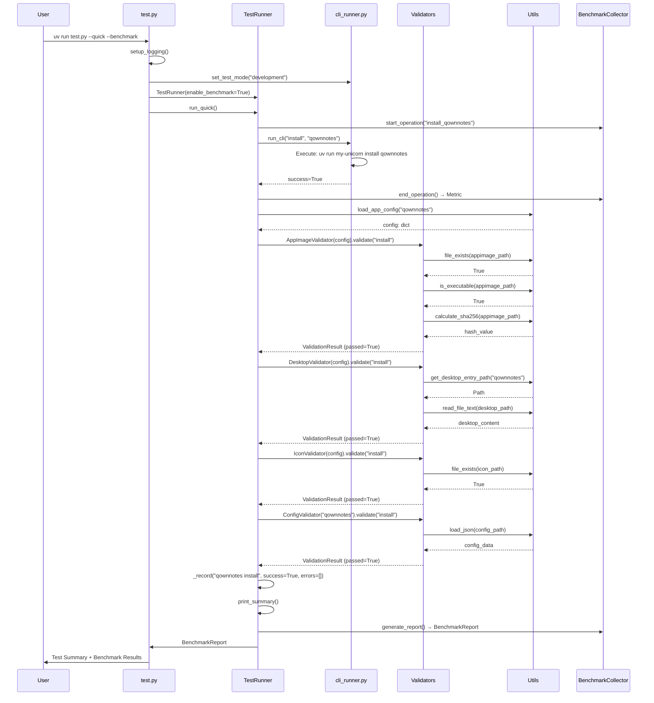
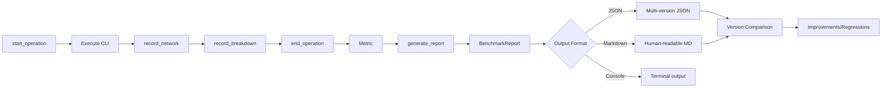

# Integration Test Framework Architecture

## Overview

The `scripts/tests/` directory implements a production-grade integration testing framework for my-unicorn, a Python 3.12+ CLI tool for managing AppImages. The framework provides comprehensive validation of install, update, remove, migrate, and upgrade operations with integrated performance benchmarking.

### Purpose

This test framework serves as the primary quality gate for my-unicorn releases, ensuring:

- **Functional Correctness**: All CLI operations work end-to-end
- **State Integrity**: AppImages, configs, desktop entries, icons, and cache are valid
- **Performance Tracking**: Version-to-version comparison with regression detection
- **Cross-Environment Testing**: Supports both development (uv run) and production (installed) modes

### Design Principles

- **KISS**: Simplicity over abstraction - each component has a single, clear responsibility
- **DRY**: Reusable utilities eliminate code duplication across validators
- **Pure Functions**: Utilities are stateless and side-effect-free for easy testing
- **Modular**: Clean separation between execution, validation, utilities, and benchmarking

---

## Architecture Components

The framework is organized into four architectural layers:

```mermaid
graph TB
    accTitle: Test Framework Architecture
    accDescr: Four-layer architecture with Entry Point, Execution, Validation, and Utilities layers
    
    subgraph "1. Entry Point Layer"
        TestPy[test.py<br/>CLI Interface]
    end
    
    subgraph "2. Execution Layer"
        Runner[runner.py<br/>Test Orchestration]
        CLIRunner[cli_runner.py<br/>CLI Execution]
        Config[config.py<br/>Config Management]
        Log[log.py<br/>Logging Setup]
    end
    
    subgraph "3. Validation Layer"
        AppImageV[validators/appimage.py<br/>AppImage Validation]
        DesktopV[validators/desktop.py<br/>Desktop Entry Validation]
        IconV[validators/icon.py<br/>Icon Validation]
        ConfigV[validators/config.py<br/>Config Validation]
        CacheV[validators/cache.py<br/>Cache Validation]
    end
    
    subgraph "4. Utilities Layer"
        FileOps[utils/file_ops.py<br/>File Operations]
        HashOps[utils/hash_ops.py<br/>SHA Verification]
        JSONOps[utils/json_ops.py<br/>JSON I/O]
        PathOps[utils/path_ops.py<br/>Path Construction]
        CLIUtils[utils/cli_utils.py<br/>CLI Helpers]
        
        Collector[benchmark/collector.py<br/>Metrics Collection]
        Reporter[benchmark/reporter.py<br/>Report Generation]
    end
    
    TestPy --> Runner
    Runner --> CLIRunner
    Runner --> AppImageV
    Runner --> DesktopV
    Runner --> IconV
    Runner --> ConfigV
    Runner --> CacheV
    Runner --> Collector
    
    CLIRunner --> CLIUtils
    
    AppImageV --> FileOps
    AppImageV --> HashOps
    AppImageV --> PathOps
    
    DesktopV --> FileOps
    DesktopV --> PathOps
    
    IconV --> FileOps
    IconV --> PathOps
    
    ConfigV --> JSONOps
    ConfigV --> PathOps
    
    CacheV --> JSONOps
    CacheV --> PathOps
    
    Collector --> Reporter
```



---

## Component Details

### Layer 1: Entry Point

#### [test.py](../scripts/tests/test.py)

**Purpose**: CLI interface for running integration tests

**Key Functions**:

- `main()` - Argument parsing and test mode dispatch
- `setup_logging(debug: bool)` - Configure console and file logging

**Test Modes**:

| Flag | Description | Apps Tested |
|------|-------------|-------------|
| `--quick` | Fast validation suite | qownnotes only |
| `--comprehensive` | Full test suite | qownnotes, librewolf, zen-browser |
| `--test-large-apps` | Large AppImage testing | Joplin (>250MB) |
| `--test-backup` | Backup functionality | Config backup/restore |
| `--test-remove` | Remove operations | App cleanup validation |
| `--test-migrate` | Config migration | V1 → V2 migration |
| `--test-upgrade` | Self-upgrade | my-unicorn upgrade |

**Execution Modes**:

- `--dev` - Development mode (uv run my-unicorn)
- `--production` - Production mode (installed ~/.local/bin/my-unicorn)

**Benchmarking**:

- `--benchmark` - Enable performance tracking
- `--benchmark-format {console,json,markdown}` - Report format
- `--benchmark-output <path>` - Save report to file
- `--get-benchmark` - Retrieve latest benchmark results

**Example Usage**:

```bash
# Quick validation with benchmarking
uv run scripts/tests/test.py --quick --dev --benchmark

# Comprehensive test in production mode
uv run scripts/tests/test.py --comprehensive --production --benchmark-output results.json

# Large app testing with markdown report
uv run scripts/tests/test.py --test-large-apps --benchmark --benchmark-format markdown
```

---

### Layer 2: Execution

#### [runner.py](../scripts/tests/runner.py)

**Purpose**: Orchestrates test execution with validation and benchmarking

**Class**: `TestRunner`

**State**:

- `test_results: list[dict]` - Aggregated test outcomes
- `benchmark: BenchmarkCollector | None` - Performance tracker
- `failed_tests: int` - Failure count
- `passed_tests: int` - Success count
- `total_warnings: int` - Warning count

**Key Methods**:

| Method | Description | Returns |
|--------|-------------|---------|
| `run_quick()` | Fast test suite (qownnotes) | None |
| `run_comprehensive()` | Full test suite (3 apps) | None |
| `run_large_apps()` | Large AppImage test (Joplin) | None |
| `test_backup()` | Config backup/restore | None |
| `test_remove()` | Remove operations | None |
| `test_migrate()` | Config migration V1→V2 | None |
| `test_upgrade()` | Self-upgrade test | None |
| `_test_install(app, is_catalog)` | Install + validation | None |
| `_test_update(app)` | Update + validation | None |
| `_record(test_name, success, errors)` | Track result | None |
| `print_summary()` | Log execution summary | None |
| `generate_json_report(output)` | Export benchmark JSON | None |
| `get_benchmark_report()` | Retrieve BenchmarkReport | BenchmarkReport \| None |

**Validation Integration**:

- Creates validators per operation: AppImageValidator, DesktopValidator, IconValidator, ConfigValidator, CacheValidator
- Runs validators after each install/update/remove
- Aggregates validation errors and warnings
- Records results with `_record()`

**Typical Flow (Install Test)**:

```python
def _test_install(self, app_name: str, is_catalog: bool = False) -> None:
    # 1. Benchmark start
    if self.benchmark:
        self.benchmark.start_operation(f"install_{app_name}")
    
    # 2. Execute CLI
    success = run_cli("install", app_name if is_catalog else f"--url {app_name}")
    
    # 3. Benchmark end
    if self.benchmark:
        self.benchmark.end_operation()
    
    # 4. Load config
    config = load_app_config(app_name)
    
    # 5. Create validators
    appimage_validator = AppImageValidator(config)
    desktop_validator = DesktopValidator(config)
    icon_validator = IconValidator(config)
    config_validator = ConfigValidator(app_name)
    
    # 6. Run validations
    results = [
        appimage_validator.validate("install", config=config),
        desktop_validator.validate("install", config=config),
        icon_validator.validate("install", config=config),
        config_validator.validate("install")
    ]
    
    # 7. Aggregate errors/warnings
    errors = [err for result in results for err in result.errors]
    
    # 8. Record result
    self._record(f"{app_name} install", success and not errors, errors)
```

#### [cli_runner.py](../scripts/tests/cli_runner.py)

**Purpose**: Execute my-unicorn CLI commands and manage test environment

**Key Functions**:

| Function | Signature | Description |
|----------|-----------|-------------|
| `run_cli` | `(command: str, *args, track_network: bool) -> bool` | Execute CLI with optional network tracking |
| `set_test_mode` | `(mode: str)` | Switch between dev/production |
| `get_current_test_mode` | `() -> str` | Return active mode |
| `get_installed_version` | `() -> str \| None` | Detect production version |
| `get_dev_version` | `() -> str \| None` | Detect dev version via --version |
| `remove_apps` | `(*app_names)` | Cleanup utility |

**Test Mode Management**:

```python
TEST_MODE = "development"  # Global state

def set_test_mode(mode: str) -> None:
    """Set test execution mode: 'development' or 'production'"""
    global TEST_MODE
    if mode == "development":
        TEST_MODE = "development"  # Uses: uv run my-unicorn
    elif mode == "production":
        TEST_MODE = "production"   # Uses: ~/.local/bin/my-unicorn
```

**Network Tracking**:

- Uses `psutil.net_io_counters()` to measure bytes sent/received
- Returns network time separately for benchmark breakdown
- Example: `run_cli("install", "qownnotes", track_network=True)`

**Environment**:

- Sets `CI=true` to simulate CI environment
- Captures stdout/stderr for validation

#### [config.py](../scripts/tests/config.py)

**Purpose**: Config management for testing

**Key Functions**:

| Function | Signature | Description |
|----------|-----------|-------------|
| `downgrade_app_version` | `(app_name: str, target_version: str)` | Modify config for update testing |
| `load_app_config` | `(app_name: str) -> dict` | Load app JSON config |

**Use Case**: Testing update functionality by downgrading installed version in config, then running update and validating new version.

#### [log.py](../scripts/tests/log.py)

**Purpose**: Logging setup

**Function**: `setup_logging(debug: bool) -> None`

- Console handler: INFO or DEBUG level
- File handler: `scripts/tests/test_runner.log`
- Format: `%(asctime)s - %(levelname)s - %(message)s`

---

### Layer 3: Validation

All validators implement the `BaseValidator` interface and return `ValidationResult` objects.

#### validators/\_\_init\_\_.py - Base Classes

##### `ValidationCheck`

**Purpose**: Single validation check result

**Fields**:

- `name: str` - Check identifier (e.g., "appimage_exists")
- `passed: bool` - Check outcome
- `expected: Any` - Expected value
- `actual: Any` - Actual value
- `message: str` - Human-readable description

##### `ValidationResult`

**Purpose**: Aggregated validation outcome

**Fields**:

- `checks: list[ValidationCheck]` - All checks performed
- `errors: list[str]` - Critical failures
- `warnings: list[str]` - Non-critical issues
- `metadata: dict[str, Any]` - Additional context

**Methods**:

- `passed: bool` - Property: True if no errors
- `add_check(check: ValidationCheck)` - Append check
- `add_error(error: str)` - Append error
- `add_warning(warning: str)` - Append warning

##### `BaseValidator`

**Purpose**: Abstract base class for validators

**Methods**:

- `validate(operation: str, **kwargs) -> ValidationResult` - Abstract method

##### `DiagnosticValidator`

**Purpose**: Orchestrates multiple validators for comprehensive validation

**Constructor**: `DiagnosticValidator(app_name: str, config: dict, operation: str, validators: list[BaseValidator])`

**Method**: `run_all() -> tuple[list[str], list[str]]` - Returns (errors, warnings)

#### [validators/appimage.py](../scripts/tests/validators/appimage.py)

**Purpose**: Validate AppImage file integrity and hash verification

**Class**: `AppImageValidator`

**Constructor**: `AppImageValidator(config: dict)`

**Validation Checks**:

| Check | Operation | Description |
|-------|-----------|-------------|
| `appimage_exists` | install, update | File exists, is file, size > 0 |
| `appimage_executable` | install, update | Has execute permission |
| `appimage_min_size` | install, update | >= 1MB sanity check |
| `sha256_verification` | install, update | SHA256 hash matches config |
| `sha512_verification` | install, update | SHA512 hash matches config |
| `appimage_removed` | remove | File deleted successfully |

**Methods**:

| Method | Signature | Description |
|--------|-----------|-------------|
| `validate` | `(operation: str, **kwargs) -> ValidationResult` | Main validation dispatcher |
| `validate_install` | `(config: dict) -> ValidationResult` | Post-install checks |
| `validate_remove` | `(app_path: Path) -> ValidationResult` | Verify deletion |
| `_verify_sha256` | `(app_path: Path, expected: str) -> ValidationCheck` | SHA256 verification |
| `_verify_sha512` | `(app_path: Path, expected: str) -> ValidationCheck` | SHA512 verification |
| `verify_hash` | `(app_path: Path, expected: str, algorithm: str) -> bool` | Independent hash verification |

**Example**:

```python
validator = AppImageValidator(config)
result = validator.validate("install", config=config)
if not result.passed:
    for error in result.errors:
        logger.error(f"AppImage validation failed: {error}")
```

#### [validators/desktop.py](../scripts/tests/validators/desktop.py)

**Purpose**: Validate .desktop file creation and content

**Class**: `DesktopValidator`

**Constructor**: `DesktopValidator(config: dict)`

**Validation Checks**:

| Check | Description |
|-------|-------------|
| `desktop_entry_exists` | File exists at ~/.local/share/applications/ |
| `desktop_entry_valid` | Has required fields: [Desktop Entry], Exec, Icon, Name, Type |
| `desktop_type_valid` | Type is Application, Link, or Directory |
| `desktop_exec_path_correct` | Exec matches config's installed_path |
| `desktop_icon_path_correct` | Icon matches config's icon.path |

**Methods**:

| Method | Signature | Description |
|--------|-----------|-------------|
| `validate` | `(operation: str, **kwargs) -> ValidationResult` | Main validation |
| `_parse_desktop_file` | `(content: str) -> dict` | Parse key=value pairs |
| `_validate_structure` | `(desktop_data: dict) -> list[ValidationCheck]` | Structure checks |
| `_cross_validate_with_config` | `(desktop_data: dict, config: dict) -> list[ValidationCheck]` | Config consistency |

**Example Desktop Entry Validation**:

```
[Desktop Entry]
Name=QOwnNotes
Exec=/home/user/Applications/qownnotes.AppImage
Icon=/home/user/Applications/.icons/qownnotes.png
Type=Application
```

#### [validators/icon.py](../scripts/tests/validators/icon.py)

**Purpose**: Validate icon extraction and format

**Class**: `IconValidator`

**Constructor**: `IconValidator(config: dict)`

**Validation Checks**:

| Check | Description |
|-------|-------------|
| `icon_exists` | File exists at config's icon.path |
| `icon_size_valid` | Size > 0 bytes |
| `icon_format_valid` | PNG or SVG format (magic number detection) |
| `icon_reuse_detected` | (Optional) Detects if icon was reused vs re-extracted |

**Methods**:

| Method | Signature | Description |
|--------|-----------|-------------|
| `validate` | `(operation: str, **kwargs) -> ValidationResult` | Main validation |
| `_detect_format` | `(icon_path: Path) -> str \| None` | PNG/SVG magic number detection |
| `_detect_icon_reuse` | `(icon_path: Path, reference_time: float) -> bool` | Mtime-based reuse detection |

**Format Detection**:

- **PNG**: Checks for `\x89PNG\r\n\x1a\n` magic bytes
- **SVG**: Checks for `<svg` or `<?xml` in first 1KB

#### [validators/config.py](../scripts/tests/validators/config.py)

**Purpose**: Validate app config JSON schema and state consistency

**Class**: `ConfigValidator`

**Constructor**: `ConfigValidator(app_name: str)`

**Schema Support**:

- **V1 (Legacy)**: Flat structure with `repo_owner`, `repo_name`, `installed_version`
- **V2.0.0 (Current)**: Nested structure with `metadata`, `state`, `verification`, `icon`

**Validation Checks**:

| Check | Description |
|-------|-------------|
| `config_exists` | File exists at ~/.config/my-unicorn/apps/{app_name}.json |
| `config_valid_json` | Valid JSON structure |
| `config_version_match` | Matches expected version (V1 or V2.0.0) |
| `appimage_exists` | AppImage file referenced in config exists |
| `appimage_executable` | AppImage has execute permission |
| `installed_version_present` | State has installed_version field |
| `installed_date_present` | State has installed_date field |
| `state_fields_complete` | Required V2 fields: version, installed_date, installed_path, verification, icon |

**Methods**:

| Method | Signature | Description |
|--------|-----------|-------------|
| `validate` | `(operation: str, **kwargs) -> ValidationResult` | Main validation dispatcher |
| `_validate_v1` | `(config: dict) -> list[ValidationCheck]` | V1 schema checks |
| `_validate_v2` | `(config: dict) -> list[ValidationCheck]` | V2 schema checks |
| `_cross_validate_filesystem` | `(config: dict) -> list[ValidationCheck]` | Cross-reference with files |
| `_validate_state_logic` | `(config: dict) -> list[ValidationCheck]` | Internal state consistency |

**Example V2 Config**:

```json
{
  "version": "2.0.0",
  "metadata": {
    "repo_owner": "pbek",
    "repo_name": "QOwnNotes",
    "app_name": "qownnotes"
  },
  "state": {
    "installed_version": "24.1.5",
    "installed_date": "2024-01-30T10:30:00Z",
    "installed_path": "/home/user/Applications/qownnotes.AppImage"
  },
  "verification": {
    "sha256": "abc123...",
    "sha512": "def456..."
  },
  "icon": {
    "path": "/home/user/Applications/.icons/qownnotes.png",
    "format": "png"
  }
}
```

#### [validators/cache.py](../scripts/tests/validators/cache.py)

**Purpose**: Validate GitHub release cache state and asset filtering

**Class**: `CacheValidator`

**Constructor**: `CacheValidator(app_name: str)`

**Validation Checks**:

| Check | Description |
|-------|-------------|
| `cache_exists` | File exists at ~/.config/my-unicorn/cache/releases/{app_name}.json |
| `cache_valid_json` | Valid JSON structure |
| `cache_assets_filtered` | Only AppImage and checksum files present (no Windows/Mac) |
| `cache_version_consistent` | Cache version matches config's installed_version |

**Methods**:

| Method | Signature | Description |
|--------|-----------|-------------|
| `validate` | `(operation: str, **kwargs) -> ValidationResult` | Main validation |
| `_check_required_fields` | `(cache_data: dict) -> list[ValidationCheck]` | Verify release_data, cached_at |
| `_validate_asset_filtering` | `(cache_data: dict) -> list[ValidationCheck]` | Only .AppImage and checksums |
| `_validate_version_consistency` | `(cache_data: dict, config: dict) -> list[ValidationCheck]` | Compare cache vs config |

**Asset Filtering Logic**:

- **Allowed**: `*.AppImage`, `*.sha256`, `*.sha512`, `SHA256SUMS`, `SHA512SUMS`
- **Filtered**: `*.exe`, `*.dmg`, `*.zip`, `*.tar.gz` (Windows/Mac artifacts)

---

### Layer 4: Utilities

All utility modules provide **pure, reusable functions** with no side effects.

#### [utils/cli_utils.py](../scripts/tests/utils/cli_utils.py)

**Purpose**: CLI execution helpers

**Functions**:

| Function | Signature | Description |
|----------|-----------|-------------|
| `run_command` | `(command: list[str], mode: str) -> tuple[bool, str, str]` | Execute CLI (dev/prod) |
| `get_version` | `(mode: str) -> str \| None` | Extract version from --version |
| `cleanup_test` | `(*app_names)` | Remove test apps |
| `command_exists` | `(command: str) -> bool` | Check PATH for command |

#### [utils/file_ops.py](../scripts/tests/utils/file_ops.py)

**Purpose**: File system operations

**Functions**:

| Function | Description |
|----------|-------------|
| `file_exists(path: Path) -> bool` | Check file exists |
| `dir_exists(path: Path) -> bool` | Check directory exists |
| `create_dir(path: Path)` | Create directory |
| `delete_file(path: Path)` | Delete file |
| `read_file_text(path: Path) -> str` | Read text file |
| `write_file_text(path: Path, content: str)` | Write text file |
| `get_file_size(path: Path) -> int` | Get file size in bytes |
| `is_executable(path: Path) -> bool` | Check execute permission |
| `copy_file(src: Path, dst: Path)` | Copy file |
| `get_file_mtime(path: Path) -> float` | Get modification time |

#### [utils/hash_ops.py](../scripts/tests/utils/hash_ops.py)

**Purpose**: SHA hash calculations

**Functions**:

| Function | Signature | Description |
|----------|-----------|-------------|
| `calculate_sha256` | `(file_path: Path) -> str` | Chunked SHA256 (8KB chunks) |
| `calculate_sha512` | `(file_path: Path) -> str` | Chunked SHA512 (8KB chunks) |
| `verify_hash` | `(file_path: Path, expected: str, algorithm: str) -> bool` | Compare hash |
| `hash_string` | `(content: str, algorithm: str) -> str` | Hash string content |

**Design**: Memory-efficient chunked reading for large AppImages (100MB+)

#### [utils/json_ops.py](../scripts/tests/utils/json_ops.py)

**Purpose**: JSON I/O operations

**Functions**:

| Function | Signature | Description |
|----------|-----------|-------------|
| `load_json` | `(file_path: Path) -> dict` | Load JSON with orjson |
| `save_json` | `(file_path: Path, data: dict)` | Save JSON with orjson |
| `is_valid_json` | `(file_path: Path) -> bool` | Validate JSON |
| `merge_dicts` | `(base: dict, override: dict) -> dict` | Recursive merge |
| `get_nested_value` | `(data: dict, key_path: str) -> Any` | Dot-notation lookup |

**Design**: Consistent orjson usage across framework for performance

#### [utils/path_ops.py](../scripts/tests/utils/path_ops.py)

**Purpose**: Path construction helpers

**Functions**:

| Function | Returns | Description |
|----------|---------|-------------|
| `get_config_dir()` | `Path` | ~/.config/my-unicorn |
| `get_apps_dir()` | `Path` | ~/Applications |
| `get_icons_dir()` | `Path` | ~/Applications/.icons |
| `get_cache_dir()` | `Path` | ~/.config/my-unicorn/cache/releases |
| `get_app_config_path(app_name)` | `Path` | ~/.config/my-unicorn/apps/{app}.json |
| `get_cache_path(app_name)` | `Path` | Cache file path |
| `get_desktop_entry_path(app_name)` | `Path` | Desktop entry path |
| `get_appimage_path(app_name, version)` | `Path` | AppImage path |
| `expand_path(path)` | `Path` | Expand ~ and env vars |
| `ensure_dir_exists(path)` | `None` | Create directory |

**Design**: Centralized path logic eliminates hardcoded paths

---

### Layer 4: Benchmarking

#### [benchmark/\_\_init\_\_.py](../scripts/tests/benchmark/__init__.py) - Data Models

##### `Metric`

**Purpose**: Single operation performance metric

**Fields**:

- `operation: str` - Operation identifier (e.g., "install_qownnotes")
- `duration_ms: float` - Total time in milliseconds
- `network_time_ms: float` - Network I/O time
- `core_time_ms: float` - Processing time (duration - network)
- `bytes_downloaded: int` - Network bytes received
- `timestamp: str` - ISO 8601 timestamp
- `breakdown: dict[str, float]` - Component-level timings

**Auto-Calculated**:

- `core_time_ms = duration_ms - network_time_ms`

##### `VersionComparison`

**Purpose**: Version-to-version performance comparison

**Fields**:

- `baseline_version: str` - Previous version
- `current_version: str` - Current version
- `improvements: dict[str, float]` - Operations with speedup %
- `regressions: dict[str, float]` - Operations with slowdown %
- `threshold: float` - Significance threshold (default 5%)
- `timestamp: str` - Comparison timestamp

##### `BenchmarkReport`

**Purpose**: Complete test run report

**Fields**:

- `version: str` - my-unicorn version
- `timestamp: str` - Run timestamp
- `metrics: dict[str, Metric]` - Operation metrics
- `resources: dict[str, Any]` - Resource usage (CPU%, memory, disk I/O)
- `environment: dict[str, str]` - Environment info (Python, OS, CPU)
- `comparisons: list[VersionComparison]` - Version comparisons
- `summary: dict[str, Any]` - Aggregate statistics

#### [benchmark/collector.py](../scripts/tests/benchmark/collector.py)

**Purpose**: Metrics collection during test execution

**Class**: `BenchmarkCollector`

**State**:

- `active_operations: dict[str, dict]` - In-progress operations
- `metrics: dict[str, Metric]` - Completed metrics
- `resources: dict[str, Any]` - Resource tracking
- `version: str` - my-unicorn version

**Methods**:

| Method | Signature | Description |
|--------|-----------|-------------|
| `start_operation` | `(name: str) -> str` | Begin timing, return context_id |
| `end_operation` | `(context_id: str) -> Metric` | Stop timing, return Metric |
| `record_network` | `(context_id: str, time_ms: float, bytes: int)` | Track network I/O |
| `record_breakdown` | `(context_id: str, component: str, time_ms: float)` | Component timing |
| `generate_report` | `() -> BenchmarkReport` | Create report with env/resources |

**Resource Tracking**:

- **CPU**: Average CPU% during operations
- **Memory**: Peak RSS (Resident Set Size)
- **Disk I/O**: Read/write bytes
- **Efficiency Score**: `bytes_downloaded / core_time_ms`

**Class**: `BenchmarkTimer` (Context Manager)

**Usage**:

```python
with BenchmarkTimer(collector, "install_qownnotes") as timer:
    # Do work
    timer.record_network(network_time_ms=150, bytes_downloaded=10485760)
    timer.record_breakdown("download", 150)
    timer.record_breakdown("verification", 50)
```

**Methods**:

- `__enter__() -> BenchmarkTimer` - Start timing
- `__exit__()` - End timing and record metric

#### [benchmark/reporter.py](../scripts/tests/benchmark/reporter.py)

**Purpose**: Report generation and version comparison

**Functions**:

| Function | Signature | Description |
|----------|-----------|-------------|
| `generate_json_report` | `(report: BenchmarkReport, output: Path)` | Multi-version JSON |
| `generate_markdown_report` | `(report: BenchmarkReport, output: Path)` | Human-readable MD |
| `load_benchmark_reports` | `(file_path: Path) -> dict` | Load past reports |
| `get_latest_benchmark` | `(file_path: Path) -> BenchmarkReport \| None` | Retrieve latest |
| `calculate_improvements` | `(baseline: BenchmarkReport, current: BenchmarkReport, threshold: float) -> VersionComparison` | Detect regressions/improvements |

**JSON Report Structure**:

```json
{
  "versions": {
    "1.0.0": { "version": "1.0.0", "timestamp": "...", "metrics": {...}, ... },
    "1.1.0": { "version": "1.1.0", "timestamp": "...", "metrics": {...}, ... }
  },
  "latest_version": "1.1.0",
  "comparisons": [
    {
      "baseline_version": "1.0.0",
      "current_version": "1.1.0",
      "improvements": { "install_qownnotes": 12.5 },
      "regressions": {},
      "threshold": 5.0
    }
  ]
}
```

**Regression Detection**:

- Threshold: >5% change is significant
- Improvements: Speedup > 5%
- Regressions: Slowdown > 5%

**Markdown Report Sections**:

1. **Environment**: Python version, OS, CPU, memory
2. **Resource Usage**: CPU%, memory, disk I/O, efficiency
3. **Performance Metrics**: Operation durations, network time, core time
4. **Comparisons**: Version-to-version improvements/regressions

---

## Data Flow

### Install Test Execution Flow



### Benchmark Data Flow



---

## Integration Points

### 1. CLI ↔ Validators

**[runner.py]** orchestrates validation:

```python
# Create validators
appimage_validator = AppImageValidator(config)
desktop_validator = DesktopValidator(config)
icon_validator = IconValidator(config)
config_validator = ConfigValidator(app_name)

# Run validations
results = [
    appimage_validator.validate("install", config=config),
    desktop_validator.validate("install", config=config),
    icon_validator.validate("install", config=config),
    config_validator.validate("install")
]

# Aggregate errors
errors = [err for result in results for err in result.errors]
```

**Data Flow**:

- Runner loads config from `utils/json_ops.py`
- Passes config dict to validators
- Validators use utils for file operations (never call CLI)
- Results flow back as `ValidationResult` objects

### 2. Benchmarking Integration

**[runner.py]** wraps CLI calls:

```python
if self.benchmark:
    self.benchmark.start_operation(f"install_{app_name}")

success = run_cli("install", app_name)

if self.benchmark:
    self.benchmark.end_operation()
```

**[cli_runner.py]** provides network tracking:

```python
def run_cli(command: str, *args, track_network: bool = False):
    if track_network:
        net_start = psutil.net_io_counters()
    
    # Execute CLI
    
    if track_network:
        net_end = psutil.net_io_counters()
        bytes_downloaded = net_end.bytes_recv - net_start.bytes_recv
        # Return network_time_ms, bytes_downloaded
```

**Network Time Separation**:

- `core_time_ms = duration_ms - network_time_ms`
- Isolates processing performance from network variability

### 3. Utils ↔ Validators

All validators import from **[utils/\_\_init\_\_.py]**:

```python
from .utils import (
    file_exists, is_executable, get_file_size,
    calculate_sha256, calculate_sha512,
    load_json, is_valid_json,
    get_config_dir, get_app_config_path
)
```

**Zero Duplication**:

- Same utilities used across all validators
- Pure functions enable easy unit testing
- Consistent error handling

### 4. Config Management

**Test Update Flow**:

```python
# 1. Downgrade version in config
downgrade_app_version("qownnotes", "23.0.0")

# 2. Run update
success = run_cli("update", "qownnotes")

# 3. Validate new version
config = load_app_config("qownnotes")
assert config["state"]["installed_version"] == "24.1.5"
```

### 5. Reporting

**Multi-Version Tracking**:

```json
{
  "versions": {
    "1.0.0": { ... },
    "1.1.0": { ... },
    "1.2.0": { ... }
  },
  "latest_version": "1.2.0",
  "comparisons": [
    {
      "baseline_version": "1.1.0",
      "current_version": "1.2.0",
      "improvements": { "install_qownnotes": 12.5 },
      "regressions": {}
    }
  ]
}
```

**Regression Detection**:

- Threshold: >5% change
- Improvements: Speedup > 5%
- Regressions: Slowdown > 5%

---

## Key Design Patterns

### 1. Validation Pattern

**Abstract Base**:

```python
class BaseValidator(ABC):
    @abstractmethod
    def validate(self, operation: str, **kwargs) -> ValidationResult:
        pass
```

**Polymorphism**:

- All validators implement same interface
- Operation-aware behavior (install/update/remove)
- Consistent result format

**Result Object**:

```python
result = ValidationResult()
result.add_check(ValidationCheck(
    name="appimage_exists",
    passed=True,
    expected=True,
    actual=True,
    message="AppImage exists"
))
result.add_error("Critical failure")
result.add_warning("Non-critical issue")
```

### 2. Utility Modules

**Pure Functions**:

- No state
- No side effects
- Composable

**Single Responsibility**:

- `file_ops.py` - File system
- `hash_ops.py` - SHA calculations
- `json_ops.py` - JSON I/O
- `path_ops.py` - Path construction

### 3. Benchmark Context Management

**RAII Pattern**:

```python
with BenchmarkTimer(collector, "install_qownnotes") as timer:
    # Work automatically timed
    timer.record_network(network_time_ms=150, bytes_downloaded=10485760)
    timer.record_breakdown("download", 150)
    timer.record_breakdown("verification", 50)
# Metric automatically recorded on exit
```

### 4. Test Mode Abstraction

**Global State**:

```python
TEST_MODE = "development"  # or "production"

def run_cli(command: str, *args):
    if TEST_MODE == "development":
        cmd = ["uv", "run", "my-unicorn"] + [command] + list(args)
    else:
        cmd = ["my-unicorn"] + [command] + list(args)
```

**Benefits**:

- Test both installed and dev versions
- Single codebase for both modes
- Easy switching via CLI flag

### 5. Multi-Version Benchmarking

**Versioned Storage**:

```python
reports = {
    "versions": {
        "1.0.0": report_v1,
        "1.1.0": report_v2,
        "1.2.0": report_v3
    }
}
```

**Comparison Engine**:

```python
def calculate_improvements(baseline, current, threshold=5.0):
    for operation in current.metrics:
        baseline_duration = baseline.metrics[operation].duration_ms
        current_duration = current.metrics[operation].duration_ms
        change_pct = ((baseline_duration - current_duration) / baseline_duration) * 100
        
        if change_pct > threshold:
            improvements[operation] = change_pct
        elif change_pct < -threshold:
            regressions[operation] = abs(change_pct)
```

---

## Testing Best Practices

### 1. Run Tests After Changes

**Critical**: Run tests after any CLI code changes to ensure nothing breaks.

```bash
# Quick validation (fast)
uv run scripts/tests/test.py --quick --dev

# Comprehensive suite
uv run scripts/tests/test.py --comprehensive --dev

# With benchmarking
uv run scripts/tests/test.py --quick --benchmark --benchmark-output results.json
```

### 2. Test Both Modes

**Development Mode**:

```bash
uv run scripts/tests/test.py --quick --dev
```

**Production Mode**:

```bash
# First install
./install.sh -e  # or: uv tool install --editable . --force

# Then test
uv run scripts/tests/test.py --quick --production
```

### 3. Benchmark Tracking

**Enable Benchmarking**:

```bash
uv run scripts/tests/test.py --quick --benchmark --benchmark-output benchmarks.json
```

**View Past Benchmarks**:

```bash
uv run scripts/tests/test.py --get-benchmark
```

**Detect Regressions**:

- Reports automatically compare with previous version
- Threshold: >5% change is significant
- Check `regressions` field in JSON output

### 4. Debugging Failures

**Enable Debug Logging**:

```bash
uv run scripts/tests/test.py --quick --dev --debug
```

**Check Log File**:

```bash
cat scripts/tests/test_runner.log
```

**Inspect Validation Results**:

- Each validator returns detailed `ValidationResult`
- Check `errors` and `warnings` fields
- Review individual `ValidationCheck` objects

### 5. Adding New Tests

**Step 1**: Add test method to [runner.py](../scripts/tests/runner.py):

```python
def test_new_feature(self) -> None:
    """Test new feature"""
    if self.benchmark:
        self.benchmark.start_operation("new_feature")
    
    success = run_cli("new-command", "args")
    
    if self.benchmark:
        self.benchmark.end_operation()
    
    # Validation
    # ...
    
    self._record("new_feature", success, errors)
```

**Step 2**: Add CLI flag to [test.py](../scripts/tests/test.py):

```python
parser.add_argument("--test-new-feature", action="store_true")

if args.test_new_feature:
    runner.test_new_feature()
```

**Step 3**: Add validators if needed (see [Layer 3: Validation](#layer-3-validation))

### 6. Adding New Validators

**Step 1**: Create validator class in `validators/`:

```python
from .import BaseValidator, ValidationResult, ValidationCheck

class NewValidator(BaseValidator):
    def __init__(self, config: dict):
        self.config = config
    
    def validate(self, operation: str, **kwargs) -> ValidationResult:
        result = ValidationResult()
        
        # Add checks
        result.add_check(ValidationCheck(
            name="check_name",
            passed=True,
            expected="value",
            actual="value",
            message="Description"
        ))
        
        if not result.passed:
            result.add_error("Error message")
        
        return result
```

**Step 2**: Integrate in [runner.py](../scripts/tests/runner.py):

```python
from validators import NewValidator

new_validator = NewValidator(config)
result = new_validator.validate("install", config=config)
```

---

## Directory Structure

```
scripts/tests/
├── __init__.py
├── test.py                    # Main entry point
├── runner.py                  # Test orchestration
├── cli_runner.py              # CLI execution
├── config.py                  # Config management
├── log.py                     # Logging setup
├── test_operations.py         # Legacy test functions
├── test_runner.log            # Test execution log
│
├── benchmark/                 # Benchmarking subsystem
│   ├── __init__.py            # Data models (Metric, BenchmarkReport, VersionComparison)
│   ├── collector.py           # BenchmarkCollector, BenchmarkTimer
│   └── reporter.py            # Report generation and comparison
│
├── utils/                     # Pure utility functions
│   ├── __init__.py
│   ├── cli_utils.py           # CLI execution helpers
│   ├── file_ops.py            # File system operations
│   ├── hash_ops.py            # SHA256/SHA512 calculations
│   ├── json_ops.py            # JSON I/O with orjson
│   └── path_ops.py            # Path construction
│
└── validators/                # Validation layer
    ├── __init__.py            # Base classes (ValidationCheck, ValidationResult, BaseValidator)
    ├── appimage.py            # AppImage validation
    ├── cache.py               # Cache validation
    ├── config.py              # Config validation (V1/V2)
    ├── desktop.py             # Desktop entry validation
    └── icon.py                # Icon validation
```

---

## Environment and Dependencies

### Python Version

- **Requirement**: Python 3.12+
- **Event Loop**: uvloop for async operations

### Key Dependencies

- **uv** - Fast Python package installer
- **aiohttp** - Async HTTP client
- **orjson** - Fast JSON library
- **psutil** - Process and system utilities (network tracking)
- **pytest** - Testing framework (for unit tests)

### Runtime Environment

- **OS**: Linux (AppImage target platform)
- **CI Variable**: `CI=true` set during test execution
- **Paths**: Uses XDG Base Directory Specification
    - Config: `~/.config/my-unicorn/`
    - Apps: `~/Applications/`
    - Desktop: `~/.local/share/applications/`

---

## Future Enhancements

### Planned Features

1. **Parallel Test Execution**
   - Run multiple install tests concurrently
   - Reduce comprehensive suite runtime

2. **Coverage Tracking**
   - Integrate with pytest-cov
   - Track test coverage of CLI code

3. **CI/CD Integration**
   - GitHub Actions workflow
   - Automatic regression detection on PR

4. **Web Dashboard**
   - Visualize benchmark trends
   - Historical performance graphs

5. **Test Data Management**
   - Fixtures for test apps
   - Snapshot testing for configs

6. **Enhanced Validators**
   - Permission validator (AppImage execute bit)
   - Symlink validator (if symlinks added)
   - Migration validator (V1→V2 upgrade paths)

---

## Troubleshooting

### Common Issues

#### 1. Test Failures

**Symptom**: Tests fail with validation errors

**Debug Steps**:

```bash
# 1. Enable debug logging
uv run scripts/tests/test.py --quick --dev --debug

# 2. Check log file
cat scripts/tests/test_runner.log

# 3. Inspect validation results
# Look for detailed error messages in console output
```

**Common Causes**:

- Config schema mismatch (V1 vs V2)
- Hash verification failure (corrupted download)
- Desktop entry missing required fields
- Icon extraction failed

#### 2. Benchmark Anomalies

**Symptom**: Benchmark shows unexpected regression

**Debug Steps**:

```bash
# 1. Check network conditions
# Network time should be separated from core time

# 2. Review breakdown
# Check component-level timings in JSON report

# 3. Compare resource usage
# CPU%, memory, disk I/O may indicate bottleneck
```

**Common Causes**:

- Network latency variability
- Disk I/O contention
- Background processes (CPU%)

#### 3. CLI Execution Failures

**Symptom**: `run_cli()` returns False

**Debug Steps**:

```bash
# 1. Check test mode
# Verify correct mode (dev/production)

# 2. Manually run command
uv run my-unicorn install qownnotes  # dev mode
my-unicorn install qownnotes         # production mode

# 3. Check PATH
echo $PATH  # Verify ~/.local/bin included
```

**Common Causes**:

- Missing uv installation (dev mode)
- my-unicorn not installed (production mode)
- PATH misconfiguration

---

## References

### Related Documentation

- [AGENTS.md](../AGENTS.md) - Project overview and development guidelines
- [config.md](./config.md) - Configuration schema and migration
- [developers.md](./developers.md) - Development setup and workflows

### External Resources

- [pytest Documentation](https://docs.pytest.org/)
- [orjson Documentation](https://github.com/ijl/orjson)
- [psutil Documentation](https://psutil.readthedocs.io/)
- [uv Documentation](https://github.com/astral-sh/uv)

---
